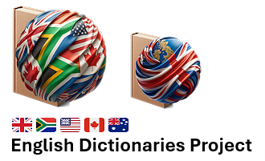

# aoo-mozilla-en-dict

**SINCE JANUARY 2026, MARCO MAINTAINS ALTERNATIVE U.S., CANADIAN, AND AUSTRALIAN DICTIONARIES.**  
**THESE en_US, en_CA, AND en_AU DICTIONARIES ARE ALTERNATIVES TO THE UPSTREAM ONES.**  
**The U.S., Canadian, and Australian dictionaries MAY differ slightly in coverage for some region-specific terms.**  

**IN MARCH 2025, THE DEFAULT BRITISH AND SOUTH AFRICAN DICTIONARIES BECAME -ISE.**

**Update:** Major fixes and improvements for US, CA, and AU on 1 Feb 2026. ✅  
**Update:** Major fixes and improvements for US on 1 Mar 2026. ✅  
**Update:** Critical update for US on 7 Mar 2026. ✅  
**Update:** Major updates to the Canadian and US dictionaries on 1 Jul 2026. ✅  
  
  
**PLEASE READ THE FOLLOWING BEFORE DOWNLOADING**  
**LIBREOFFICE EXTENSION V2026.01.01+:**  
https://bugs.documentfoundation.org/show_bug.cgi?id=167649#c19  
**This extension is maintained independently and is not part of LibreOffice core.**

---

## Introduction and Scope

For many years, active maintenance of dictionaries for open-source software has been neglected. Continuing this important work involves improving existing dictionaries and creating new ones where necessary.

A significant challenge is that most dictionaries are obfuscated — encoded in formats accessible only by specific software — with the original developers no longer available to provide plaintext versions. Consequently, we sometimes must revert to the last available clean-text versions to resume development.

Maintaining, updating, and enhancing dictionaries is a complex yet vital task, ensuring ongoing accuracy and usefulness for present and future users.

This repository contains the latest available versions of dictionaries, facilitating easy use by developers for proofing or spellchecking applications (`.AFF` and `.DIC` file formats).

I, **Marco Pinto**, actively maintain all six primary variants of English dictionaries:

* **British English** (`en_GB`)
* **British English** (`en_GB-oxendict`) (Oxford English Dictionary)
* **South African English** (`en_ZA`)
* **American English** (`en_US`) (alt) *(it took me one year of careful preparation before the initial U.S. release)*
* **Canadian English** (`en_CA`) (alt)
* **Australian English** (`en_AU`) (alt)

To learn more about Marco Pinto, his background, projects, and contributions to open-source language tools, read the full article at [marcoagpinto.com](https://marcoagpinto.com).

Kevin Atkinson maintains independent versions of `en_GB`, `en_US`, `en_CA`, and `en_AU`, which have been valuable points of comparison during the development and evaluation of these dictionaries. For more details, see:

* [Kevin Atkinson's GitHub](https://github.com/en-wl/wordlist)
* [Kevin Atkinson's Website](http://wordlist.aspell.net)

Dwayne Bailey previously maintained the `en_ZA` dictionary but has since ceased maintenance. His website, associated with the South African government, is no longer operational, and previous contact methods are inactive.

---

## Ethics and Principles

Language is a shared human good. It should remain free, open, and accessible to everyone, regardless of race, religion, gender, age, country, income, profession, or academic background.

My main goal is to make these English dictionaries freely available, accurate, and inclusive for all users. Everyone should have equal access to words and spelling tools, whether they are the owner of a multinational company or the person sweeping the street.

These dictionaries are maintained with the belief that language belongs to humankind as a whole. It is a tool for learning, communication, dignity, and opportunity. For that reason, this project is kept free, regularly updated, and available across English variants, so that anyone can write and use English with confidence.

I live a simple and modest life, choosing not to monetise this work so that everyone can benefit from it freely. However, if you fork these dictionaries or use them in your own projects, please credit this project somewhere visible. This work is the result of many years of maintenance, correction, expansion, and careful review; it should not be presented as someone else’s work after only adding or removing a small number of words.

---

## Release Cycle

Regular dictionary updates are released three times per year — on the **first day of January, May, and September** — unless there is something urgent to address, in which case a release may be published earlier.

Monthly releases are no longer feasible due to the considerable workload associated with maintaining six dictionary variants.

Each release enters a feature freeze approximately one week before publication, allowing time to prepare release notes, update websites, and finalise packaging. This process ensures accuracy and stability across all dictionaries.

**Note:**
Since late 2025, the AOO Extensions website has been read-only, so only a LibreOffice (LO) extension is now maintained. This extension can also be installed and used in Apache OpenOffice (AOO).

The LO and former AOO extensions are identical in content; they previously differed only in naming and update URLs. For more details, see [this LibreOffice bug report](https://bugs.documentfoundation.org/show_bug.cgi?id=148250).

A changelog for dictionary updates is available in `2025+_Release_notes.txt`.

---

## Repository Folder Structure

Each dictionary folder on GitHub includes:

* `.AFF` file (Hunspell affix rules)
* `.DIC` file (dictionary entries)
* `README` file (`.txt` format)
* `WORDLIST` file (`.txt` format)
* Compressed (zipped) folder files

---

## Installation and Documentation

Installation instructions and additional project documentation are available on the [Proofing Tool GUI website](https://proofingtoolgui.org).

* [Installation instructions](https://proofingtoolgui.org/en_installing.html) — installation in Mozilla applications, LibreOffice, and Apache OpenOffice.
* [Dictionary notes](https://proofingtoolgui.org/en_GB_README.html) — additional information about the English dictionaries.
- [Complete British English dictionary changelog](https://proofingtoolgui.org/en_GB_CHANGES.txt) — words, corrections, and other changes introduced over the years in the `en_GB` dictionary.
* [Project history and involvement](https://proofingtoolgui.org/getting_involved.html) — historical information about the project and its development.

The main website also provides direct installation information for Mozilla applications and LibreOffice.

---

## Licence

All dictionaries maintained by Marco Pinto are licensed under the [GNU Lesser General Public License, version 3 or any later version](https://www.gnu.org/licenses/lgpl-3.0.en.html).

The full licence texts applicable to the dictionaries are included at the end of the file `README_en_GB_ZA_US_CA_AU.txt`.

---

## Canadian English and the -ise/-ize Question (1 Jul 2026)

Canadian English is probably the most difficult variety of English to support because it combines features from both British and U.S. English.

To better reflect contemporary Canadian usage and address user feedback, the Canadian dictionary now adopts a mixed approach, combining selected British and U.S. forms where appropriate.

The dictionary now accepts both -ise and -ize verb forms, includes commonly used U.S. medical and scientific terms, and better reflects the mixed British/U.S. nature of modern Canadian English.

The goal is to reduce unnecessary spelling warnings while supporting the widest possible range of Canadian users.

---

## Plans for 2027 and Beyond

See the [project roadmap](ROADMAP.md) for planned dictionary improvements and future development.  

